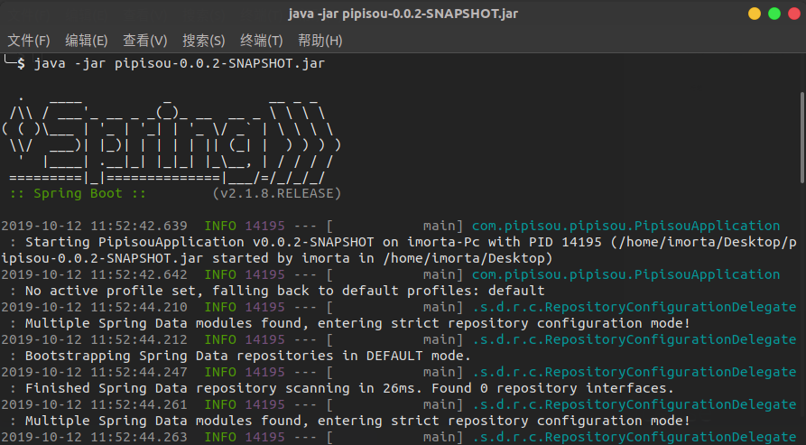
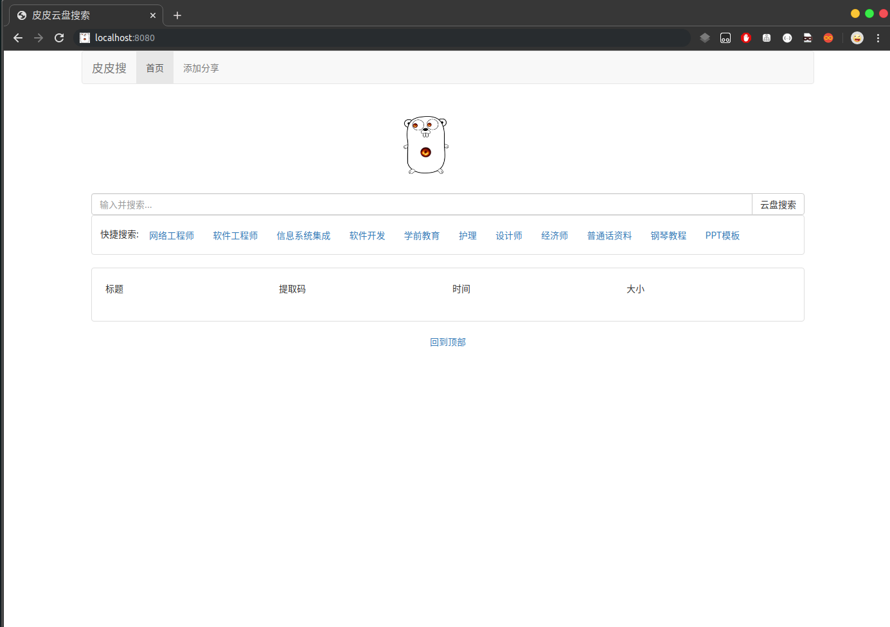
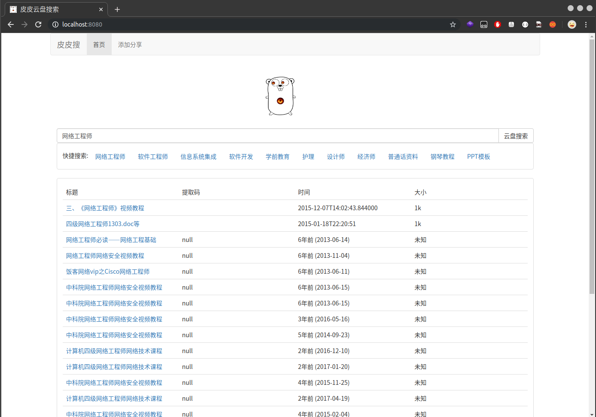

# pipisou

pipisou Cloud Disk Search Engine

皮皮云盘搜索引擎 分享

- [Java](./java)

- [PHP](./php)

# Run

## 开发环境

- MySQL

- JDK 1.8以上

- Maven

```bash
git clone https://github.com/cexll/pipisou.git
```

```
Java 在 application.properties 配置数据库用户密码
PHP 在 DB.php 配置数据库用户名密码
```


#### Java 1.8 运行效果

`java -jar pipisou-0.0.2-SNAPSHOT.jar `







### PHP 运行效果

`将项目配置到nginx 例子`

```
location / {
            root   /web/yunpan;
            index  index.html index.php;
        add_header Access-Control-Allow-Origin *;
        add_header Access-Control-Allow-Methods 'GET, POST, OPTIONS';
        add_header Access-Control-Allow-Headers 'DNT,Keep-Alive,User-Agent,Cache-Control,Content-Type,Authorization';
        }
```

# License

[Apache 2.0](LICENSE) 

Copyright (c) 2019-present cexll
